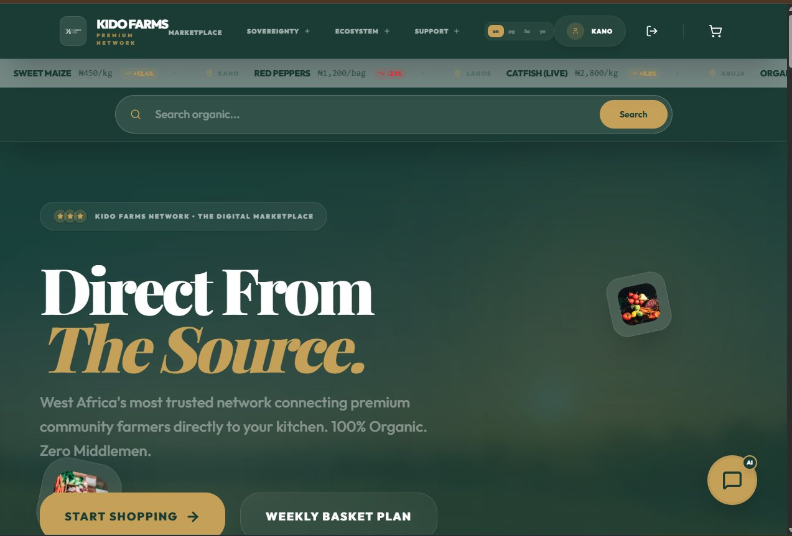
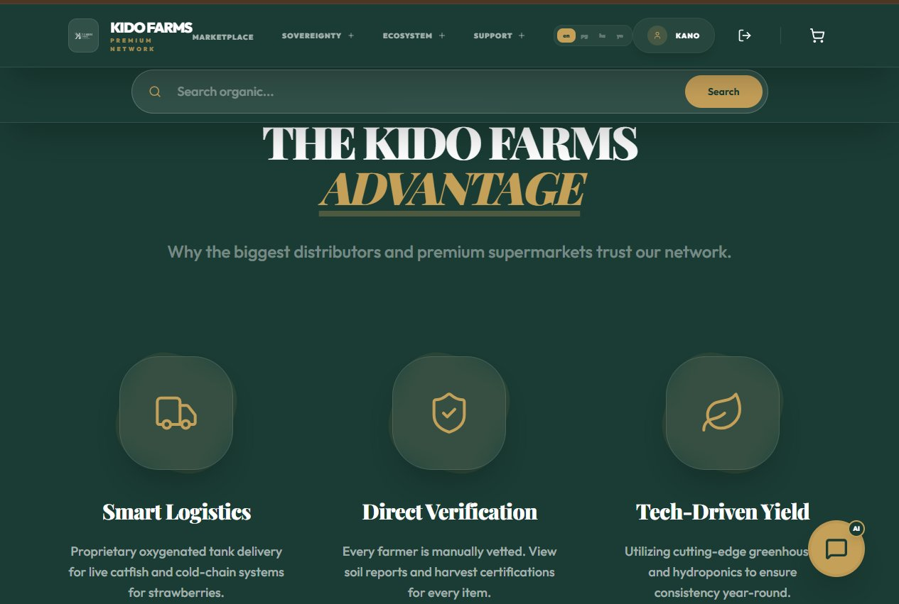
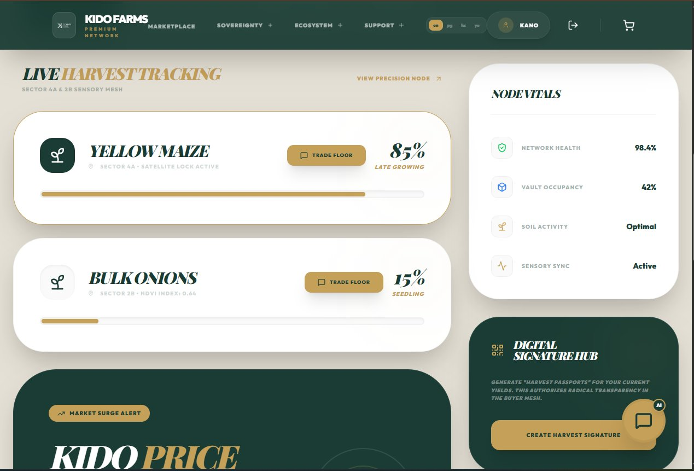
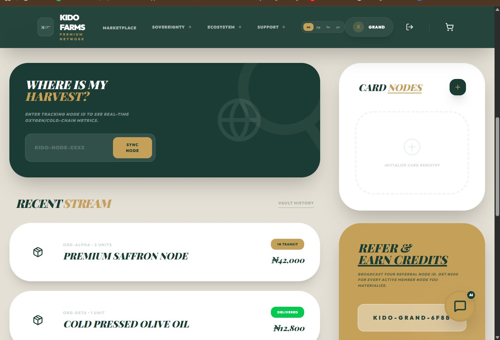
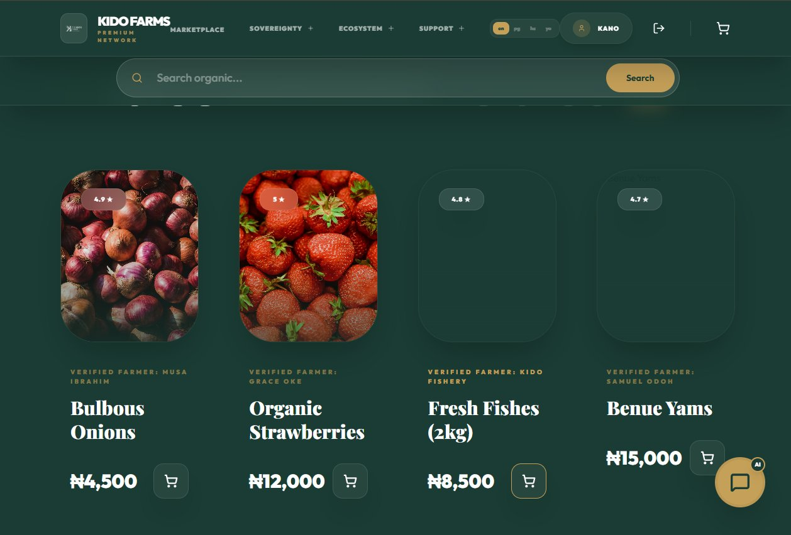
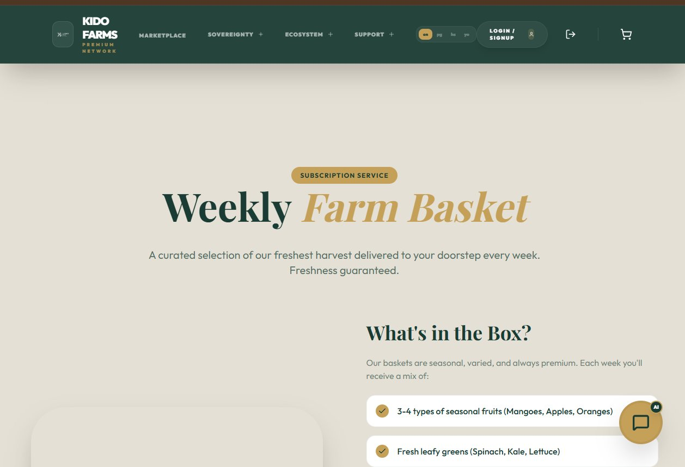

<div align="center">
  
  <h1>Kido Farms — Sovereignty Network</h1>
  <p><strong>West Africa's farm-to-table digital marketplace</strong><br/>Connecting verified community farmers directly to consumers. 100% Organic. Zero Middlemen.</p>

  
  
  
  
  
  
  
</div>

---

## Screenshots

| Landing | Marketplace |
|---|---|
|  |  |

| Live Harvest Tracking | Buyer Dashboard |
|---|---|
|  |  |

| Products | Subscriptions |
|---|---|
|  |  |

---

## Overview

Kido Farms is a full-stack agritech marketplace built to digitise the West African agricultural supply chain. Farmers list verified produce with traceable **Harvest Passports**, buyers shop with confidence knowing exactly where food comes from, and the platform handles logistics, payments, and real-time field monitoring end-to-end.

---

## Features

### 🛒 Marketplace
- Browse and search verified organic produce from community farmers
- Live market price ticker across Nigerian cities (Kano, Lagos, Abuja…)
- Product ratings, reviews, and farmer profiles
- Multi-language support

### 🌾 Farmer / Supplier Tools
- Harvest dashboard with NDVI satellite index and growth stage tracking
- Digital Harvest Passport generation (QR-based traceability)
- Voice harvest wizard for low-literacy input
- Poultry GIS monitoring
- Story feed for farm updates

### 📦 Orders & Logistics
- Paystack checkout (card, bank transfer, USSD)
- Real-time order tracking with node IDs
- Cold-chain and oxygenated tank delivery tracking
- Fleet overview map and logistics mesh

### 🏢 B2B & Wholesale
- B2B Procurement Command for hotels, supermarkets, and distributors
- Consumption credits and node refill system
- Group buys and bulk pricing

### 📅 Subscriptions
- Weekly Farm Basket — curated seasonal produce delivered to your door
- Subscriber dashboard with schedule, basket, and payment management

### 🔐 Auth & Roles
- Email/password signup with account verification
- Google OAuth
- Password reset flow
- Roles: Admin, Farmer, Supplier, Vendor, Buyer, Subscriber, Carrier, Staff, Affiliate, Wholesaler, Distributor, Retailer

### 🛠 Admin Dashboard
- Full inventory, order, user, and vendor management
- Sensor and warehouse monitoring
- Finance, escrow, payouts, and investment tracking
- Staff task matrix, ticket system, and verification queue
- AI configuration panel

### 🌍 Other
- Impact Score — CO₂ saved and farm families supported
- Affiliate and referral system (₦500 per active member)
- KidoConcierge AI chat assistant
- Academy (agri-education content)
- Energy and Global Bridge modules

---

## Tech Stack

| Layer | Technology |
|---|---|
| Frontend | Next.js 15, TypeScript, Tailwind CSS, NextAuth.js |
| Backend | Node.js, Express.js |
| Database | PostgreSQL, Drizzle ORM |
| Payments | Paystack |
| Storage | Cloudinary |
| Maps | OpenStreetMap / Geoapify |
| Auth | NextAuth (Credentials + Google OAuth) |
| Deployment | Vercel (frontend), Railway / Render (backend) |
| Mobile | Capacitor (iOS / Android shell) |

---

## Project Structure

```
kido-farms-ecommerce/
├── frontend/                  # Next.js app
│   ├── src/
│   │   ├── app/               # App Router pages
│   │   │   ├── admin/         # Admin dashboard
│   │   │   ├── dashboard/     # Role-based dashboards
│   │   │   ├── marketplace/   # Storefront
│   │   │   └── ...
│   │   ├── components/        # Shared UI components
│   │   ├── lib/               # API client, auth config
│   │   └── knowledge/         # KidoAI knowledge base
│   └── public/
├── backend/                   # Express API
│   └── src/
│       ├── routes/            # API route handlers
│       ├── middleware/        # Auth, rate limiting
│       └── db/                # Drizzle schema + migrations
├── docs/
│   ├── screenshots/
│   ├── Kido_Farms_Full_Architecture.md
│   └── Kido_Farms_Access_Matrix.md
└── README.md
```

---

## Getting Started

### Prerequisites
- Node.js 18+
- PostgreSQL 16+
- A Paystack account (test keys work for dev)
- A Cloudinary account (for image uploads)

### 1. Clone

```bash
git clone https://github.com/Uszkido/kidofarms-frontend.git
cd kidofarms-frontend
```

### 2. Frontend

```bash
cd frontend
cp .env.local.example .env.local
# Fill in your values
npm install
npm run dev
```

### 3. Backend

```bash
cd backend
cp .env.example .env
# Fill in your values
npm install
npm run dev
```

### 4. Database

```bash
cd backend
npm run db:push   # Push schema to your PostgreSQL instance
npm run db:seed   # Optional: seed with sample data
```

Frontend runs on `http://localhost:3000`, backend on `http://localhost:5000`.

---

## Environment Variables

### Frontend (`frontend/.env.local`)

| Variable | Description |
|---|---|
| `NEXT_PUBLIC_API_URL` | Backend API base URL |
| `NEXTAUTH_URL` | Your frontend URL |
| `NEXTAUTH_SECRET` | Random 32-char secret |
| `NEXT_PUBLIC_PAYSTACK_PUBLIC_KEY` | Paystack public key |
| `GOOGLE_CLIENT_ID` | Google OAuth client ID |
| `GOOGLE_CLIENT_SECRET` | Google OAuth client secret |

### Backend (`backend/.env`)

| Variable | Description |
|---|---|
| `PORT` | Server port (default 5000) |
| `DATABASE_URL` | PostgreSQL connection string |
| `JWT_SECRET` | Random 32-char secret |
| `PAYSTACK_SECRET_KEY` | Paystack secret key |
| `CLOUDINARY_CLOUD_NAME` | Cloudinary cloud name |
| `CLOUDINARY_API_KEY` | Cloudinary API key |
| `CLOUDINARY_API_SECRET` | Cloudinary API secret |

See `frontend/.env.local.example` and `backend/.env.example` for full templates.

---

## Scripts

### Frontend
| Command | Description |
|---|---|
| `npm run dev` | Start dev server |
| `npm run build` | Production build |
| `npm run lint` | Run ESLint |

### Backend
| Command | Description |
|---|---|
| `npm run dev` | Start dev server (nodemon) |
| `npm run db:push` | Push Drizzle schema |
| `npm run db:seed` | Seed database |

---

## Contributing

1. Fork the repo
2. Create a feature branch: `git checkout -b feat/your-feature`
3. Commit with conventional commits: `git commit -m "feat: add your feature"`
4. Push and open a Pull Request

---

## License

MIT © 2026 Kido Farms. See [LICENSE](LICENSE) for details.

---

<div align="center">
  <sub>Built with ❤️ for West African farmers and their communities.</sub>
</div>
